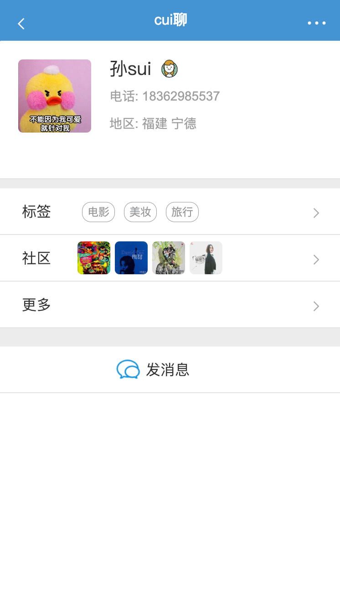
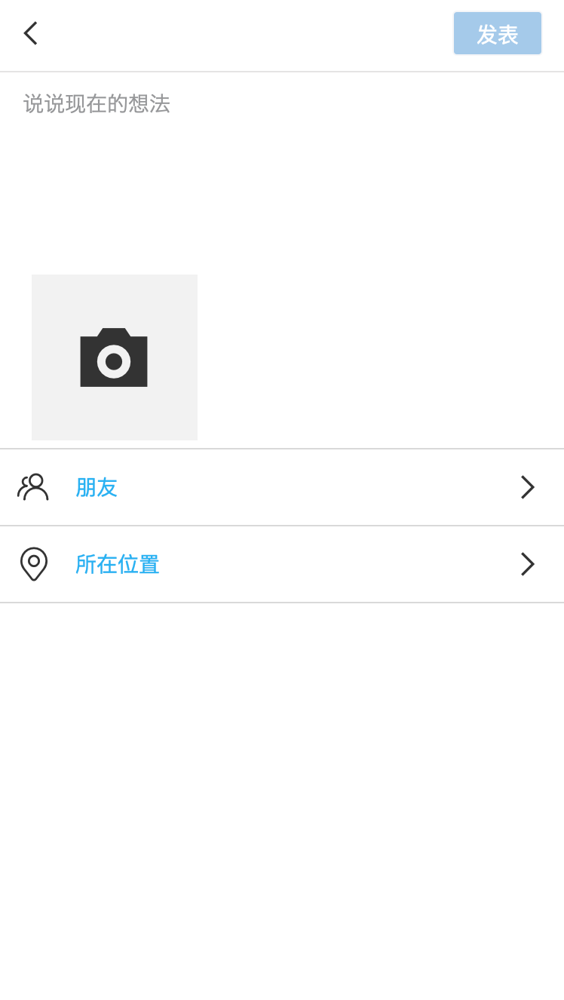
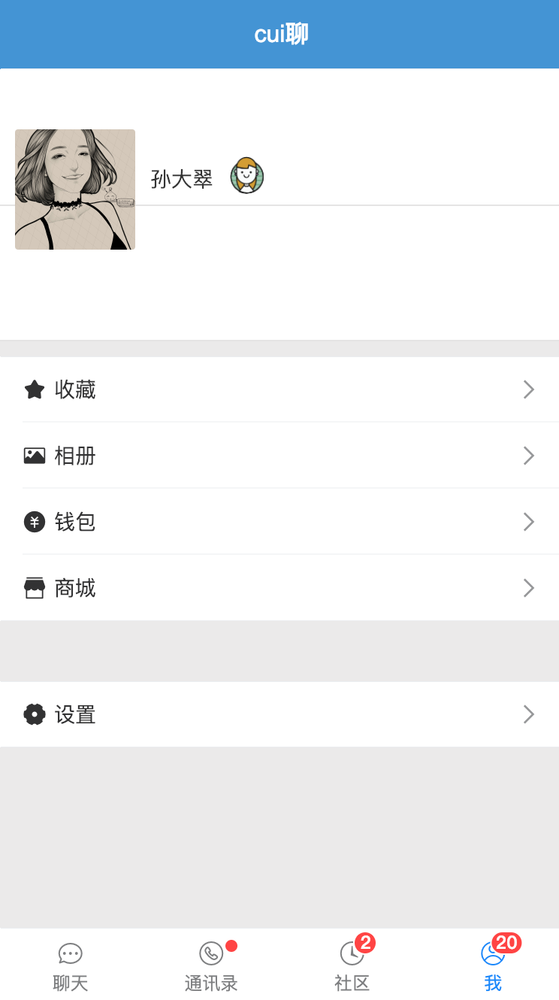

# vue-chat

> 基于vue仿微信单页应用


## 相关界面
### 聊天列表页

### 对话框页

### 通讯录页

### 查看他人信息页

### 朋友圈页

### 发表页

### 个人中心页



## Build Setup

``` bash
# install dependencies
npm install

# serve with hot reload at localhost:8080
npm run dev

# build for production with minification
npm run build

# build for production and view the bundle analyzer report
npm run build --report

# run unit tests
npm run unit

# run e2e tests
npm run e2e

# run all tests
npm test
```

For a detailed explanation on how things work, check out the [guide](http://vuejs-templates.github.io/webpack/) and [docs for vue-loader](http://vuejs.github.io/vue-loader).
